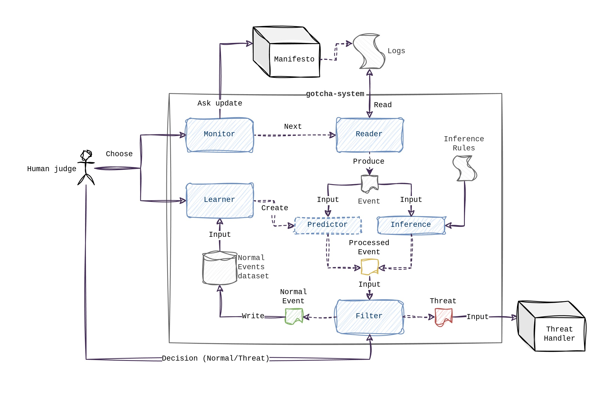

# Architecture

The following diagram illustrates the components that make up the system and how they work together:

An overview of the components

- **System to protect**: a digital system that needs to be monitored to detect security issues in time; every relevant change in this system (an *event*) is registered, forming *Logs* 
- **Logs**: a list of events in some format
- **Parser**: a program that reads from Logs, line by line, to construct for each event, a structured entity (of type *Event*) which represents such event in a way it can be reasoned on by the *Diagnosis Module*
- **Diagnosis Module**: a program that receives an event and decides (or predicts) whether it constitutes suspicious activity or not by reasoning on the current *decision rules*; the result of this process is a *labeled event*
- **Storage Module**: a program that stores labeled events produced by the diagnosis module into a database system (even a simple csv file); the currently stored data forms a *dataset of labeled events* 
- **Learning Module**: a program that analyses the data in the dataset to discover new information (es. patterns) that may be used to extend the *decision rules* to make predictions more complete and accurate.
